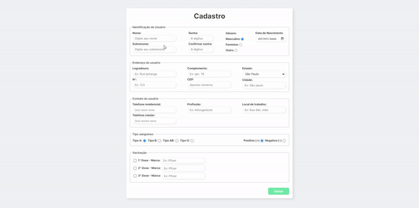
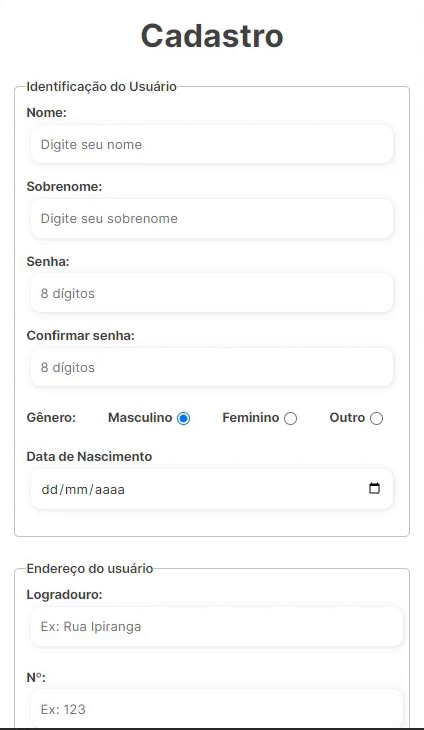

# Corona System Form

This is a simple form created for a college project related to Covid-19 🦠.

## Table of Contents
- <a href="#description">Description</a>
- <a href="#tools-used">Tools Used</a>
- <a href="#layout-preview">Layout Preview</a>
- <a href="#usage-instructions">Usage Instructions</a>
- <a href="#deployment">Deployment</a>
- <a href="#contact">Contact</a>

## Description

This is a project I had to do for college, where we had to create an interface for an application called "Coronavirus System." The purpose of the application was to register Brazilians and it had to include specific information such as vaccination status and blood type, as well as standard information like name, password, address, etc. Initially, only the HTML part was required, but I took the opportunity to add CSS and make it responsive for all commonly used devices.

## Tools Used 

- <a href="https://developer.mozilla.org/pt-BR/docs/Web/HTML" target="_blank">HTML5</a>
- <a href="https://developer.mozilla.org/pt-BR/docs/Web/CSS" target="_blank">CSS3</a>

## Layout preview
You can also watch those short previews of how it looks either on desktop or mobile version:

### Desktop

### Mobile

## Usage Instructions
To use the project locally, follow the instructions below:

- Clone this repository to your local machine.
- Open the **index.html** file in a web browser.

## Deployment
The project is deployed using GitHub Pages. You can access it by clicking the link below:

<a href="https://wesleysantosdev.github.io/corona-system-form/" target="_blank">Corona System Form</a>

## Contact
If you have any suggestions for this project, feel free to contact me:

- Name: Wesley Santos
- Email: wesleysantosdev@outlook.com
- GitHub: @wesleysantosdev

I hope you enjoy this project!